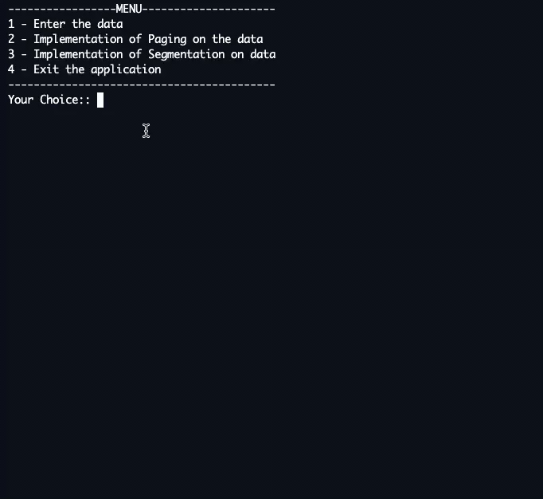

# Paging and Segmentation in C
- Concept used to show the implementation of the Paging and Segmentation scheme in C. 
- The program allows us to visualize the method in which paging and segmentation might take place in an Operating System. 

## Link: https://repl.it/@maidaNsiddique/PagingandSegmentation#main.c

## Demo: 

## Algorithm:
Implemented the visualization of the Paging and Segmentation scheme as done by an operating system. 
The program takes multiple processes and their required memory as input and outputs the visualization table.
